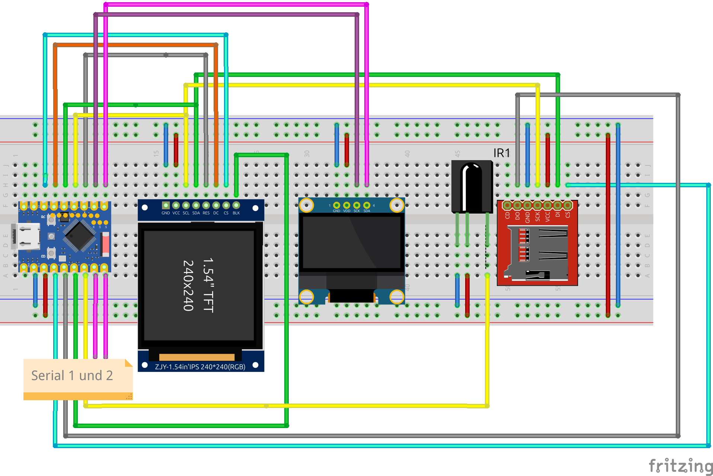
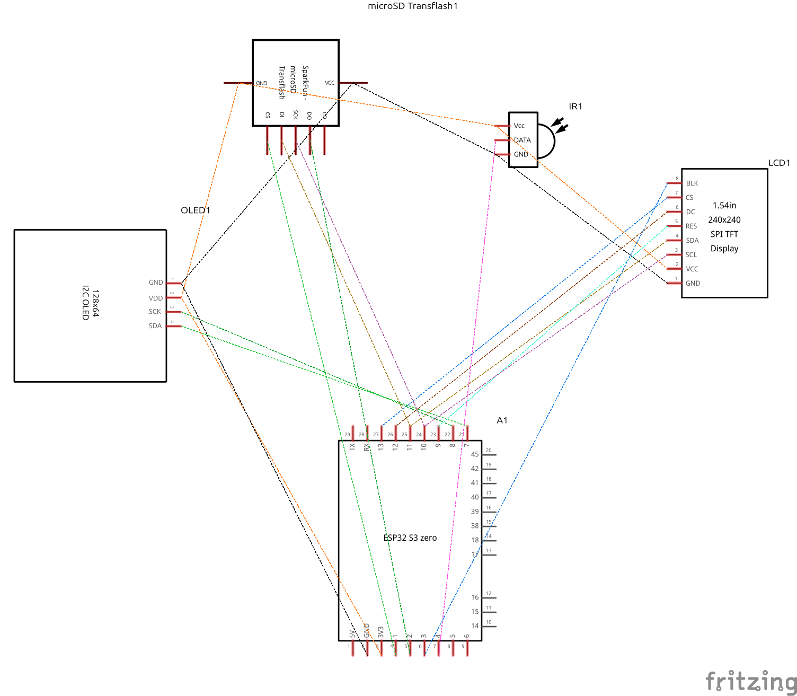

# SerialSniffer 

Monitor two UART lines (RX+TX) using an esp32-s3-devkitc-1. Serial parameters can be set using a CLI and webinterface. Data output using USB/ display and (optional) HTTP and syslog as date;direction;HEX;ASCII. Ignore lines starting with '#' to get CSV compatible data. Send ?\n on USB and webinterface for supported configuration.
- TFT Display
- OLED Display
- WLAN Hotspot if no connection to WLAN
- ESPA Call to JSON 

IR Pins von unten: gn,bl,lila
Klemmstein von links: GND, GND, T1(A), R1(A), T2(B), R2(B)
